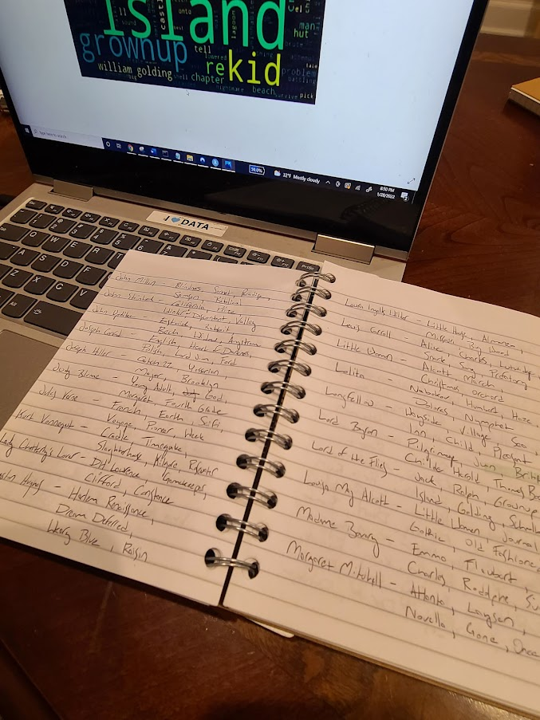
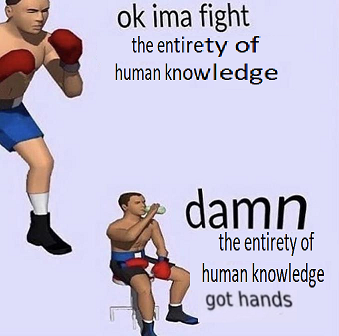

<div align="center"><i>“You don’t just need to 'know stuff,' you need to know the right stuff.”</i>
- Amy Schneider, <a href="https://defector.com/how-i-got-smart/" target="_blank"><i>How I Got Smart</i></a>

<i>“Bury me in my cool jacket.”</i>
- Dwight Eisenhower, presumably</div>


<h2>Hi, I’m Zach.</h2>


Yesterday, I was on Jeopardy! That was awesome! I didn't win! And I'll be real: that was less awesome!

To be fair, I knew that it would potentially hurt even before going on: during my preparation for the show, I read posts just like this from former contestants - winners and losers alike – detailing how they got ready, the experience of competing, the aftermath, yadda yadda yadda. But as these posts helped me with my prep, it’s only right that I pay all that forward by writing my own. Call it a postmortem: a little overview of where I started, what I did, where I was at trivia-wise when I went on the show, all that. There are going to be a lot of charts, because, as Johnny Gilbert pointed out on national television yesterday, I’m a data analyst.^[JOHNNY EFFIN’ GILBERT SAID MY NAME! ON TELEVISION! NOBODY CAN EVER TAKE THAT AWAY FROM ME!] I mean, I've done data stuff to <a href="https://public.tableau.com/app/profile/zach.gozlan#!/vizhome/AEWTrueskillDashes/Dashboard1?publish=yes" target="_blank">rank professional wrestlers</a> and
<a href="https://github.com/zachgozlan/facebook-messenger-json-parsing" target="_blank">write a wedding speech</a>, so of course I was going to try to data my way into trivia glory. (I have a hammer. I see nails.) This is as much me writing up my latest pet project as anything - and you can check my GitHub if you'd like to see the <i>really</i> nerdy guts of this - but I tried my best to write this at a level where you don't have to know anything about this here data nonsense to understand it. If you’re a potential future contestant, here's what I tried! If you’re just a fan of the show, here’s some cool stuff about the questions that I found! And if you’re a friend of mine who is reading this because I forced you to, I appreciate your sacrifice! Alright cool here we go

```{r, include = FALSE, message=FALSE}
#

library(ggplot2) #plotting
library(plotly) #INTERACTIVE plotting
require(tidyverse) #piping, etc.
require(dplyr)
library(foreign)
library(haven)
library(plyr)
library(heatmaply) #trying to solve some error message issues
library(reticulate) #using python
library(gridExtra) #positioning
library(ggrepel)
library(treemap)
library(zoo)
library(knitr)

manualcolors<-c('black','forestgreen', 'red2', 'orange', 'cornflowerblue',  'darkolivegreen4', 'indianred1', 'tan4', 'darkblue', 
                'mediumorchid1','firebrick4',  'yellowgreen', 'lightsalmon', 'tan3',
                "tan1",'darkgray', 'wheat4', '#DDAD4B', 'chartreuse', 
                'seagreen1', 'moccasin', 'mediumvioletred', 'seagreen','cadetblue1',
                "darkolivegreen1" ,"tan2" ,   "tomato3" , "#7CE3D8","gainsboro")

knitr::knit_engines$set(python = reticulate::eng_python) #in case I desperately need a python something
knitr::opts_chunk$set(warning = FALSE, message = FALSE) 


assessments <- read_csv('jeop_assessments.csv')
assessments$Date <- as.Date(assessments$Date, "%m/%d/%Y")
assessments$Index <- (assessments$Index)*2
```

<h2>Where I Started</h2>
<h4><b>I was good - but I wasn't <i>good</i>. You follow?</h4></b>

To get on Jeopardy!, you need to do well on the audition test, do well on a follow-up test that is basically the audition test again, do well on a third test where they weigh your heart against a feather to judge your worthiness, and then you just sit there for a while and hope you’re the DC resident that they pick for that set of tapings.^[If you don’t live in the DC area, you may instead be from California, New York, Boston, or Other.] There’s no stated threshold for what “good enough” means on the first two tests - at least as far as I’m aware - but the received wisdom is that it’s around 35 right answers on the 50-question test. Part of the fuzziness is that you never get your results back from the test; the only confirmation that you “passed” is that you get called in for another audition. But because ambiguity is scary to me, after my first few attempts at the test I got in the habit of filming myself taking it so that I could check my work after.^[I tried out something like six or seven times over a span of twelve years, going back to teen tournament auditions in 2008.] This is how I knew I was right at that cut line after I took the Anytime Test in May 2021, and while I sure as hell wasn't going to chance getting caught recording the follow-up test a month later, I did sit in my yard afterwards checking every question I could remember.^[22 for-sure right, 10 for-sure wrong, 18 lost to history.] I was doing, as far as I could tell, just well enough to pass on both.

The implication of that was terrifying: everyone I would be competing against is either as good as me, or – <i>dear god</i> – better.

Further, when I sat down, started watching Jeopardy! every night with a pen and paper and began actually keeping track of how many questions I was getting right, the variance was wild: I was having some great days (45 right! Nailed a triple stumper! THERMIDOR!), but some days where I was getting absolutely slammed. That was concerning, as in my head I was sometimes leaving half the board uncontested for my phantom challengers. Add in having to buzz in against two other dorks just to get a chance to answer, and it meant I’d probably only get the opportunity to even answer about ten questions of the sixty.^[On top of all that, Matt Amodio’s run beginning right after I started prepping, which, y'know, speaking of terrifying.] Basically, I realized I needed to get <i>good</i> fast if I wanted to have any shot at this thing. So I had a quick little panic attack about how inadequate I was and how no one would ever love me, and then I got to trying to find the fastest way to get to that next level. I'd have to study more <b>efficiently</b> if I wanted to make up ground on my competition, I had to lean into my strengths. I saw myself as having two advantages relative to my average imaginary Jeopardy! opponent:

- <b>Time.</b> Specifically, I had a lot of time and nothing to do. (This is also true at the time of writing.) I finished grad school in May 2020 and started my current job soon after, but the pandemic was not super conducive to finding regular commitments beyond work. I live alone and do not have family obligations to attend to, and I had recently gotten out of a relationship right around the time I started going through the audition process.^[She was kind enough to wait until right after I had taken the second test to end things, to not distract me; it was very considerate, and we remain friends.] This was my main thing I did in spare time for months, even before I knew I was going to be on the show.
- <b>Data Literacy.</b> I mentioned it's my day job, and definitely not something everyone would have been doing. My thinking was literally, "If I can... something something... data... with the.... questions? That'd be - that could work."^[I was very nervous when I started planning this and my thoughts were not especially coherent.]

<h2>Something Something Data With the Questions</h2>

If you’re someone who keeps up with the art of studying for Jeopardy!, most of the rest of this can be summed up really quickly: I basically DIY’d the Roger Craig thing with a few added features. If you don’t know what that means, the best way for me to explain it starts with these two facts:

- The professional wrestler known as the “Anxious Millennial Cowboy” is <b>Adam Page.</b>
- While John F. Kennedy was the President of the United States, his First Lady was <b>Jacqueline Kennedy.</b>

If you have watched even five minutes of the show, you should be able to guess which of the above has come up on the show dozens of times, and which has never come up even once.^[If you’ve never watched even five minutes of Jeopardy – how did you manage that, and how did you get here?] Everyone who watches the show sort of knows this ranking of importance intuitively – if I told you that you were going on Jeopardy! tomorrow, you’d probably rather use that precious 24 hours studying American presidents than Canadian prime ministers, state capitals over county seats, and winners of the Best Actress Oscar over the recipients of the coveted MTV Movie Award for Best Kiss.^[You may or not sleep; I got a respectable five hours in the night before taping, and I'm as proud of that as anything.] <b>What I wanted to do was to use data, instead of intuition, to make those decisions about what to study with the limited time that I had.</b>

I started by downloading a <a href="https://github.com/jwolle1/jeopardy_clue_dataset" target="_blank">public data set of all Jeopardy! questions</a> through the most recent season (at the time, through Season 36). This included about 46,000 distinct categories, from stalwarts like <a href="https://j-archive.com/search.php?search=potpourri&submit=Search" target="_blank">Potpourri</a> and <a href="https://j-archive.com/search.php?search=transportation&submit=Search" target="_blank">Transportation</a> to oddball one-offs like <a href="https://www.j-archive.com/showgame.php?game_id=1569" target="_blank">The Astronaut Hall of Fame</a> and <a href="https://www.j-archive.com/showgame.php?game_id=4417" target="_blank">Clarinets & Seafood</a>. But this doesn’t mean that Jeopardy! has asked about 46,000 different topics, of course. For example, here’s eight “different” categories:

- HIP-HOP & R&B 2017
- HIP-HOP & RAP
- HIP-HOP FEUDS
- HIP-HOP HOORAY!
- HIP-HOP MUSICIANS' REAL NAMES
- HIP-HOP ON POP
- HIP-HOP TO IT
- HIP-HOPPERS

These are basically the same thing, in that someone who was good at one of these categories is probably going to do well on all of them. And because there are only so many famous rappers, these categories are going to overlap in both their correct responses (Jay-Z was an answer in “Old School Hip-Hop”, “Hip-Hop Hooray!”, and “Hip-Hop Feuds”) and overlap in their core concepts, like one question asking for a “cold” member of NWA (it’s Ice Cube!) and another question asking for the name of Ice Cube’s old group (it’s NWA!). Beyond this, someone like Kendrick Lamar might be mentioned in a pop music category, as well, and then Taylor Swift might then be mentioned in pop and country categories, and so on and so forth, until we've got a big pile of categories that are all asking about stuff that is thematically about the same. <b>I wrote code to identify these broader groups:</b> I set it up to sort all the categories into 250 “similar” groups based on who and what is mentioned. For more context, here's one of the groups that was output that I tagged as "modern music":

```{css, echo=FALSE}
pre {
  max-height: 300px;
  overflow-y: auto;
}

pre[class] {
  max-height: 200px;
}
```

```{css, echo=FALSE}
.scroll-100 {
  max-height: 200px;
  overflow-y: auto;
  background-color: inherit;
}
```

```{r, class.output="scroll-100"}
#Cluster 22
# ['POP MUSIC', 'SINGERS', 'POP QUIZ', 'ROCK MUSIC', "WHAT'S ON YOUR iPOD?", 'MUSIC MAKERS', 'ON THE RADIO', 'FOLK MUSIC', "\\'90s MUSIC", 'HIT TUNES', 'THE GRAMMYS', 'MUSIC VIDEOS', 'CLASSIC ALBUMS', 'FEMALE SINGERS', 'THE NATIONAL RECORDING REGISTRY', 'POP SINGERS', "TOP O' THE CHARTS", 'COLORFUL ROCK', "\\'80s ROCK", 'NO. 1 SONGS', 'DUETS', 'GRAMMY WINNERS', '21st CENTURY MUSIC', 'ALBUM COVERS', 'BEHIND THE MUSIC', 'POP-ROCK', 'MOTOWN', 'THE SONG DYNASTY', 'MUSIC TO MY EARS', 'SINGERS ALSO KNOWN AS', 'MUSIC OF TODAY', 'LET ME ENTERTAIN YOU', 'HOLIDAY ALBUMS', "MUSIC OF THE '90s", "HITS OF THE '80s", 'SINGLE-NAMED SINGERS', 'POP GOES THE MUSIC', 'POPULAR MUSIC', 'GIRL GROUPS', 'THE AMERICAN MUSIC AWARDS', "THE MUSICAL '90s", 'BILLBOARD MUSIC AWARDS', '1980s MUSIC', '\\"M.J.\\"', 'THE GRAMMY AWARDS', '1990s HITMAKERS', 'CDs', 'SINGERS "R" US', 'RECENT MUSIC', "\\'90s POP CULTURE", 'SONGS FOR YOUR CAT', 'PUT SOMETHING ON', 'POP & ROCK MUSIC', 'COUNTRY', 'TOP OF THE CHARTS', 'McCARTNEY', 'HERBS & SPICE GIRLS', 'JAMES TAYLOR: HIS LIFE & MUSIC', 'DAVID BOWIE', 'THE MUSICAL FABRIC STORE', 'FILL IN THE SONG TITLE', 'HITS & MISSES', 'CURRENT MUSIC', 'A VIRGIN CATEGORY', 'ELTON JOHN', 'POP PRINCES & PRINCESSES', 'NAME-DROPPING SONG LYRICS', 'LAYING DOWN SOME R&B & HIP-HOP VOCALS', 'BANDS', 'WOMEN OF POP', '20th CENTURY MUSIC', 'POP CULTURE POPS', 'PUSSYCAT POT-PURREE', 'HEY, I JUST MET YOU', 'MUSICAL GALS', '2017 BILLBOARD HITS', '21st CENTURY ROCK', 'I SING', "SINGLE-NAMED SINGERS' LAST NAMES", 'MUSIC MISHMASH', "HAIL, HAIL, ROCK 'N' ROLL", 'ET AL', 'HIP-HOP & RAP', 'MODERN MUSIC', 'SEA SONGS', 'THE ACADEMY OF COUNTRY MUSIC AWARDS', 'HELLO, DOLLY PARTON!', 'I NEED BACKUP', 'YELLOW MUSIC', 'BEST NEW ARTIST GRAMMY BATTLES', 'THAT WOMAN CAN SING!', 'HIP-HOP HOORAY!', 'A HIT RECENTLY', "NO. 1 HITS OF THE '90s", 'SINGERS ON POSTAGE STAMPS', 'ALT', 'ROD STEWART', 'HUSBAND & WIFE SINGERS', 'MUSICAL COLLABORATIONS', 'CAPITOL RECORDS', 'LYRICALLY YOURS', 'ODE TO BILLY JOEL', 'THE LADIES OF ROCK', "POP'S MUSIC", 'COUNTRY TWOSOMES', 'WORLD MUSIC', 'REMEMBERING MICHAEL JACKSON', 'THE 50th GRAMMYS', 'SONGS ABOUT GIRLS', 'GRAMMY 2000', 'REQUESTS', 'WE LOVE "R" MUSIC', 'THAT SONG SOUNDS FAMILIAR', '\\"T" UP SOME ENTERTAINMENT', 'DESCRIBING THE NO. 1 SONG', 'WOMEN OF MUSIC', 'THEY PLAYED COACHELLA', 'GIRLS WITH GUITARS', 'HIP-HOPPERS', 'TOP 40 BEFORE & AFTER', 'UNLIKELY POP CULTURE PAIRINGS', 'LESSER-KNOWN GRAMMYS', 'HIP-HOP ON POP', 'DIONNE WARWICK', 'DUET TO ME ONE MORE TIME', 'GRAMMYS 2005', 'SOLITARY SINGERS', 'POP SONGS', 'POP "STAR"s', "MUSIC '96", "THAT'S A RAP", "WE LOVE '80s MUSIC", 'WOMEN OF SONG', 'COUNTRY COVERS', 'REMEMBER DISCO?', '2013 CDs', 'HEY, U2!', 'PLAY MS. "T" FOR ME', 'THE HISTORY OF RAP', 'SHAKIRA', 'BOOK SONGS', 'TOP 30 TO 40 HITS', 'FEMALE COUNTRY', 'NAME THAT TUNE-STER', 'SONG ADJECTIVES', "BILLBOARD'S GREATEST HOT 100 SINGLES", 'RADIO DISNEY', 'WOMEN SINGERS', '\\"BORN" TO BE A SONG', 'SWEET GOSPEL MUSIC', '1980S POP MUSIC', 'HITMAKERS', 'RADIO-LOGY', 'MUSIC OF THE NIGHT', 'ONE   SONG', 'RAPPERS', 'SONGWRITING TEAMS', 'SING OUT!', 'MUSICAL "P"ERFORMERS', 'NORDIC TRACKS', '1990s SONGS', '\\"GOLD" RECORDS', 'POP "I\\"', 'BILLY JOEL', 'RECORDS', 'FOR A SONG', 'R&B', 'KEYBOARD CAT', 'RAP MUSIC GRAMMYS', 'McGRAW-HILL', 'WOMEN ON MY INFINITE PLAYLIST', "BILLBOARD'S TOP MONEY MAKERS OF 2011", "ON MY DOG'S iPOD", 'THEIR FIRST NO. 1 POP HIT', 'ON A BILLBOARD CHART IN 2014', 'CANARIES', '\\"GOOD" ENTERTAINMENT', 'THEIR FIRST TOP 40 POP HIT', 'ADELE', 'ALL THE SINGLES LADIES', 'FAT MUSIC', 'POP THE QUESTION', 'MUSIC FOR CHAMPS', 'WHOSE MEGA-ALBUM?', 'A BILLION VIEWS ON YOUTUBE', 'THE 1998 GRAMMYS', 'SIDES', '\\"WORLD"LY SONGS', 'WOMEN AND SONG', 'McMUSIC', 'THE PARTRIDGE FAMILY', 'SONG SUNG BLUE', 'THE GRAMMYS 2010', 'ODD ROCK WORDS', 'MY NAME IS SYMBOLIC', "\\'90s NO. 1 HITS", '\\"IT" IS A SONG', 'THE BEAT OF THE TOM', 'SONGS OF YOUR OLDER SIBLINGS', 'PARADISE BY', "SINGLE-NAMED SINGERS' HITS", 'RELATIVES IN SONG', "LIVIN' LA VIDA YOKO", 'SINGLE WOMEN', 'POP MUSIC DECADES', "ROLLING STONE'S 100 GREATEST SINGERS", 'GRAMMY-WINNING WOMEN', 'CLASSIC COFFEE TUNES', 'SELF-TITLED ALBUMS', 'ALBUM CUTS', '\\"R" SONG', 'MUSIC THE KIDS LOVE', "WE'RE NO. 2!", 'THEIR FIRST SOLO ALBUM', "BILLBOARD'S TOP ARTISTS", 'POP ON A CD', 'KATY PERRY', "NO. 1 HITMAKERS OF THE '90s", 'THEY COVERED THE BEATLES', 'SINGERS ON THE SOUNDTRACK', 'THE VOICE...', 'PICK A NUMBER FROM 1-10', 'ABBREVIATED NO. 1 HITS', 'STRAIGHT TO BILLBOARD NO. 1', 'WHOSE HIT ALBUM?', 'THEIR LAST TOP 10 POP HIT, SO FAR', "WHO'S HAD MORE NO. 1 HITS?", '10-MILLION-SELLING ALBUMS', 'GRAMMY RECORD OF THE YEAR', 'HER HIT ALBUM', "THE BRIT'S NO. 1 HIT", 'SEE THE POP HIT', '#1 HITS', 'THAT ONE SONG', 'THEIR FIRST TOP 10 SOLO HIT', 'POSTHUMOUS POP HITS', 'THEIR FIRST SOLO HIT', "THEY'RE PLAYING OUR SONGS", 'THEIR FIRST NO. 1 HIT', 'LAST TOP 10 POP HIT', 'POP TOPPERS', 'MICHAEL JACKSON HITS IN OTHER WORDS', 'THEIR TOP 40 ALBUMS', 'WEIRD AL-CHEMY', 'WHOSE BILLBOARD HIT?', 'WHAT A GIRL WANTS', 'FEMALE MUSIC SUPERSTARS', 'THEIR DEBUT ALBUMS', "\\'80s NO.1 HITMAKERS", 'ADVERTISING & MUSIC', '1989 NO. 1 HITS', 'THE BILLBOARD TOP 40', 'HIT 1980s ALBUMS', 'U.S. TOP-SELLING ALBUMS', 'BILLBOARD NO. 1 HITMAKERS', 'THEIR BIGGEST BILLBOARD HITS', '2011 MUSICMAKERS', 'BILLBOARD HOT 100 HISTORY', '1960s HIT SONGS', 'THE MUSIC INDUSTRY', '2014 ALBUMS', '2002 POP STARS', 'BILLBOARD NO. 1 ALBUMS', 'CONTEMPORARY MUSIC', 'ROCK ICONS', "HIT SONGS OF THE '90s", 'RECENT R&B & HIP-HOP HITS', 'NO. 1 POP HITS', 'THE BILLBOARD HOT 100', 'SINGERS & ALBUMS']
```

The output wasn’t perfect - and required a couple tries to get right^[One attempt at this gave me a seemingly random group of categories that were, in fact, all presented by the Clue Crew when they aired. Also, the most frequently used categories all got sorted together for some reason, so that took some time to clean up.] - but with a few manual tweaks I do stand by this as a pretty good estimation of how often Jeopardy! asks about stuff. I then sorted it into 20 or so broader themes, for example, the above got sorted into "music+modern." Here's the overall view once I put it all together:

```{r, echo=FALSE, message=FALSE, fig.width=12, fig.height=12}
subcats <- read.csv('subcats_mod.csv')


#png(file="treemap.png",
#width=1200, height=700)

treemap(subcats,
            index=c("category", "subcategory"),
            vSize="percentages",
            title="Jeopardy! Questions by Topic, Nov 2001 - Aug 2020 (attempt by: @zachgozlan)",
            type="index",align.labels = list(c("left", "top"), c("right", "bottom")),
            fontsize.labels=c(16,13)
            )
```

Because the dollar values of the questions were built into the data as well, I could also see what showed up more frequently in the more valuable Double Jeopardy! round, which affected some decisions:

```{r, echo=FALSE, message=FALSE, fig.width=10}
cats_values <- read_csv('cats_values01092022.csv')

cats_values_no_misc <- cats_values %>%
  filter(!category %in% c('miscellaneous'))

ggplot(cats_values_no_misc, aes(x=percentages, y=value)) +
  ylab('Value/Board Placement') +
  xlab('On Jeopardy!, this topic comes up...') +
  scale_y_continuous(limits=c(700, 1200), breaks=c(700,950,1200), labels=c('More Likely in\nSingle Jeopardy', '', 'More Likely in\nDouble Jeopardy')) +
  scale_x_continuous(limits=c(0, 16), breaks=c(0,1.64,3.28,8.20,16.40), labels=c('', 'Weekly', 'Biweekly', 'Daily', 'Twice\nDaily')) +
  geom_text_repel(aes(label = category), size = 4) +
  theme(panel.grid.minor = element_blank()) +
  labs(title="Jeopardy! Categories by Frequency and Value", subtitle="Excluding Miscellaneous/General Knowledge categories", caption="Credit: @zachgozlan")
```

(In all cases: if you're interested in the technical side of this, I put the code up on my github and my email, my @'s, and the like are all very guessable. I'm one of like two or three Zaches Gozlan on the planet, blessing and a curse.)

A few notes on this while we're talking about it:

- This is deeply, deeply unofficial and I bet there are better versions out there somewhere, but I needed to make my own to do the stuff I'll talk about next.
- Some categories are easier to identify and separate out by the words that they use than others; a <i>lot</i> of questions are labeled as both "geography" and "history" because many things exist both in a place and, also, at a time.
- I used all of the data from 1984-2020 to create the clusters, but for the above proportions only cared about questions from 2001 and on to split the difference between weeding out outdated questions and still having a big pool of questions to use on myself later.
- Subcategory labels are a function of what could be easily recognized, not based on any particular system; anything I wasn’t sure about got put in “general.” There could be American history question in the “general history" set if it's tucked into a broader category like <a href="https://www.j-archive.com/showgame.php?game_id=7116" target="_blank">Historic Names</a>, for example.
- If I did this over: I probably would have just folded language questions (e.g., Latin, Spanish, etc.) into "miscellaneous" and split the "people" category into "entertainment" and "history" depending on the person.
- Speaking of "Entertainment,” it was created out of necessity- questions about specific actors, general pop culture, etc. didn't easily fit into TV, film, or movies.^[Shucks, I’m <i>such</i> a Libra! :)] It was mostly created to keep those questions out of "miscellaneous" while preserving the purity of the other pop culture groups.
- "Government" is probably the worst-named category. To clarify, it also includes law questions, civics, politics, things of that flavor.

<h2>Assessing my Own Ability</h2>

I now knew I needed to study geography, history, and science topics, given that they come up basically every game.^[Because these are broad categories, I also spent some time with the subcategories trying to identify what I was lacking within them; in my case, it was European history, rivers and mountains, animals, and human anatomy.] The next thing I wanted to do was take inventory of what I knew and what I needed to study. Using these categorizations to sort everything, I gave myself a series of 50-question quizzes on each topic, randomly selected from the data, to get a sense of what I needed to shore up.^[Most of these questions I had not seen before, as, for better or for worse, I hadn't been able to watch a ton of Jeopardy! for several gaps in my life. I spent 2014 through 2018 in Oklahoma City, where Jeopardy airs at - I am not kidding, people always think I'm kidding when I say this - 3pm.] From those tests, I added <b>art</b> and <b>literature</b> to my studying priority.

```{r, echo=FALSE, message=FALSE, fig.width=10}
assessments8 <- assessments %>%  filter(Date < as.Date("2021-08-18"))

assessments8 %>%
  #filter(Category %in% c('Art', 'Music', 'Literature', 'Theater', 'Religion')) %>%
  ggplot(aes(x=Index, y=0, label=Category))+ 
  geom_text(size=2, angle=40, fontface = "bold") +
  xlab('Correct Answer %') +
  ylim(-1, 1) +
  ylab('') +
  scale_y_continuous(breaks=c(700,950,1200), labels=c('More Likely in\nSingle Jeopardy', '', 'More Likely in\nDouble Jeopardy')) +
labs(title="Where I started", subtitle="Scores on my first battery of categorical self-tests, August 2021") + theme(aspect.ratio = 1/10)
```


<h2>How I Studied</h2>
<h4>Surprise: More programming!</h4>

I probably would've only studied the normal way, mind you, but as luck would have it I stumbled upon someone else's One Weird Trick For Winning Jeopardy! that I thought was worth a shot. When Colin Davy mentioned on the program in 2020 that he was a sports analytics data scientist, I gave him a quick google to see if he knew a friend of mine who also did stuff like that. He didn't, but he had written about <a href="https://colindavy.medium.com/how-i-won-jeopardy-with-data-science-c2e9b52a1958" target="_blank">his method of creating flashcards</a> to quickly pick up on key info and so-called "Pavlov clues".^[If you don't know Jeopardy! lingo, the idea behind Pavlov clues are basically that there are certain short descriptions used in questions that almost always narrow the question down to one answer. Famous examples include "Iowa painter" for Grant Wood, or "Norwegian Playwright" for Henrik Ibsen.] I'd recommend reading his post for details about this, but the short version of his theory was that by comparing all of the clues with the same answer, you could find the key information that Jeopardy often uses to describe that answer. I don’t have the capacity to retain the entirety of a Wikipedia page into the instant-recall part of my brain on short notice, so by using this technique instead, I was able to pick out a handful of important, “trivia”-type things to remember for a wide variety of topics quickly. Efficiency!

Another plus is related to buzzer work: you need to be <u>ready</u> to ring in when it's time to ring in. Not thinking of the answer; <u>ready.</u>^[In an interview I don't feel like searching for right now, Matt Amodio said he would get a sense of if he "knew" the answer before buzzing in, buzz, and then use his time to find it in his brain.] By scanning the questions for keywords, I was able to get my answer ready with enough time to focus on the "go" signal for buzzing. This is risky - as you can probably tell from my off-by-a-mile guess of "Indus" when I saw "valley" - but I think it paid off more often than not.

Here's what I did for most topics: I'd search for the top answers that come up within each category - in this example, literature - to get a list like this:

```{css, echo=FALSE}
pre {
  max-height: 300px;
  overflow-y: auto;
}

pre[class] {
  max-height: 200px;
}
```

```{css, echo=FALSE}
.scroll-100 {
  max-height: 200px;
  overflow-y: auto;
  background-color: inherit;
}
```

```{r, class.output="scroll-100"}

# edgar allan poe               109
# agatha christie                72
# ernest hemingway               66
# stephen king                   66
# robert frost                   63
# jane ausT-                     63
# emily dickinson                60
# mark twain                     60
# f scott fitzgerald             56
# oliver twist                   56
# william faulkner               54
# james joyce                    52
# jane eyre                      52
# rudyard kipling                50
# charles dickens                50
# james fenimore cooper          50
# thomas hardy                   49
# anne rice                      48
# walt whitman                   47
# jules verne                    46
# david copperfield              46
# john grisham                   45
# a tale two cities              45
# hans christian andersen        44
# louisa may alcott              44
# 1984                           44
# elizabeth barrett browning     43
# herman melville                43
# robert louis stevenson         43
# robinson crusoe                43
# treasure island                43
# virginia woolf                 42
# anna karenina                  42
# john steinbeck                 42
# war peace                      40
# jack london                    40
# george eliot                   40
# pride prejudice                40
# dracula                        39
# the great gatsby               39
# uncle tom cabin                38
# dylan thomas                   38
# don quixote                    38
# moby dick                      38
# wuthering heights              38
# sherlock holmes                38
# nathaniel hawthorne            38
# lord byron                     37
# fahrenheit 451                 37

```
<i>The fifty most common answers for questions I tagged as "literature."</i>

I'd then run the code that makes the flashcards - including some code to pluck out obvious words like "book" and "author" out of the final product - to produce a bunch of cards that looked like this:


I'd then pick the most important/biggest words off of this card and write them in my little notebook I carried around a bunch of places:


<center></center>


And then, at crunchtime, re-transcribed that list to Excel to get it all front-of-brain:


<center></center>
<i>"I'll never forgive myself for getting the Vonnegut question wrong." - Me, to Mayim Bialik, between rounds</i>

I did this for as many topics as I could in the crunch month before running out of time, ultimately filling up about a notebook and a half. I also did this for things with fairly limited sets, like countries and elements, and things like references to nationalities (this worked pretty well!)^[The second you see the word "Welsh", immediately buzz in with Dylan Thomas.] and references to years (this didn't work at all!).

Now, did I retain all of this information? Hell no, I'm not a sponge.^["Covering enough ground" and "making sure you have what you know down" is a delicate balance that I absolutely did not get right.] But it did help me create a corpus of things I "should" know, and I felt a bit more confident in it than just googling "FAMOUS AUTHORS???" (for example) and hoping for the best.

There are <b>two major drawbacks</b> in this method that I think are worth bringing up here. For the most part, analysis like this focuses on topics that are asked about a lot, and as a result - because more obscure trivia is harder trivia is higher-dollar trivia - are usually going to be the easier questions on the board. This suited my goal of making sure I knew the basics of everything very well, but I'm not assuming everyone wants what I want.^[Other things I want: Self-actualization and those big bags of generic-brand cereal.] Secondly, it relies on the fact that the canon of famous books, famous artists, notable historical figures, et cetera doesn't change that much over time. By contrast, there is new "Jeopardy!-level notable" pieces of pop culture every year, while other, older material can fall out of the cultural consciousness fast. (I'm thirty years old, I never really struggle while watching the show with television questions, and yet supposedly "easy" TV categories from even early-2000s Jeopardy! episodes walloped me when I was studying.) 

<h4>So I Also Studied the Normal Way</h4>

I tried all sorts of normal study techniques. Some worked, some didn't.

<b>Good Ideas</b>

- As I mentioned, I <b>trawled j-archive</b> every chance I got to cram as much into my head as possible. I think the flashcard work helped augment this, as it stung more when I missed a question with an answer I had identified as "common."
- <b>Sporcle.</b> Y'all already know about Sporcle, I assume. Great for geography, good for books if you know how to filter through all the Harry Potter quizzes.
- <b>Writing questions!</b> I had heard Ken Jennings partly got good at trivia by writing questions, so I did plenty of that – I wrote about 125 distinct categories worth of questions, sometimes forcing myself into a weird theme to try to dig into topics I wouldn’t have otherwise thought of:


...although I did focus mostly on the topics I emphasized above.
 
 <b>Bad Ideas</b>
 
- i <b>went to a library to read children's books</b> a few times and this was like summer 2021 and the second time i went there i was there for like six hours and i came home and that was all i did that day and then a few days later i got a covid exposure notification and my parents had to cancel a planned trip to come see me at the last minute out of an abundance of caution and i wound up not having covid but it still turned me off from hanging out in a public library's children's section for hours and i didn't really do too much of that
- I did like a month of <b>Duolingo for Latin</b> as an attempt at getting better at etymology/word root questions?? This didn't help and now the owl's mad at me

<h2>A Quick Note on Buzzer Training</h2>
<center></center>


Do it. Everything you've heard is true.

<h2>Progress & Improvement</h2>

My goal was to get to an average of 40 questions right per episode, on the assumption that if I could swing that plus a 50% buzzer rate I'd have answered my "share" of the questions and have a decent-enough shot at winning. I repeated the category quizzes about once a month/as needed to measure progress and check to see if I needed to re-prioritize topics, and of course I also watched the show religiously to see if I was really moving the needle.

By my own metrics: over the span of the five months I was measuring my progress, I got a little bit better in terms of my percentage right on my own self-assessments and the average of how I was doing watching the show. But my "floor" was definitely pushed upwards - I watched 74 episodes total in this span, and the back half had significantly fewer "bad" games than the front half.

```{r, echo=FALSE, message=FALSE, fig.width=10}

summary <- read_csv('summary_stats.csv')
knitr::kable(summary)

```

Here's that same data, but as a chart:

```{r, echo=FALSE, message=FALSE, fig.width=10}
progress <- read_csv('progress2.csv')
progress$Date <- as.Date(progress$Date, "%m/%d/%Y")
a <- rep(NA, 21)
b <- rep(NA, 30)
c <- rep(NA, 2)
progress37 <- progress %>%  filter(Date < as.Date("2021-08-14"))
progress38 <- progress %>%  filter(Date >= as.Date("2021-09-13"))
progress$TenGame2 <- c(a, na.approx(progress37$TenGame), b, na.approx(progress38$TenGame),c)

ggplot(data=progress, aes(x=Date, group = 1)) +
  geom_line(data=progress, aes(y=TenGame2), size=1, color='red') +
  geom_line(data=progress, aes(y=WghtAvg), size = 1, color='blue') +
  geom_point(aes(y=Daily), size=1) + 
  xlim(as.Date(c('2021-07-01', '2021-12-01'), format="%m/%d/%Y") ) +
  ylab('% Correct') +
labs(title="Keeping Track of my Jeopardy! Knowledge", subtitle="Black points = individual games\nred line = ten game average (broken between seasons)\nblue line = average of self-tests")+
  scale_color_manual(values = manualcolors)

#ggsave(file="progress.jpeg", width=14, height=5, dpi=300)

```

That my episode average basically lined up with the weighted average of my category tests makes me feel pretty good that the proportions I listed above are about correct. Speaking of those, here are all of my self-assessments:

```{r, echo=FALSE, message=FALSE, fig.width=10}
p <- assessments %>%
  #filter(Category %in% c('Art', 'Music', 'Literature', 'Theater', 'Religion')) %>%
  ggplot(aes(x=Date, y=Index, color=Category))+ 
geom_line(aes(), size=1)  +
geom_point(aes(), size=2)  +
  ylab('% Correct') +
  xlab('Date') +
labs(title="My Progress on 50-Question Self-Tests, by Category")+
  scale_color_manual(values = manualcolors)

p_int <- ggplotly(p)  %>%
  layout(title = list(text = paste0('My Progress on Category Self-Tests',
                                    '<br>',
                                    '<sup>',
                                    '',
                                    '</sup>')))


ggsave(file="categories_progress.jpeg", width=10, height=6, dpi=300)

p_int
```

That last battery of assessments I took the weekend before tape day. I used that to dictate which categories I'd consider "good" and "bad" for me, for whatever that was worth. (This is why I went right for that TV category in the first round, for example.)

Progress was slower than I expected. Two potential reasons why:

1. If you imagine the entirety of Jeopardy! knowledge as a swimming pool, I was throwing in buckets every day to raise the water level. It's a lot of water, but man, it's a big pool.
2. My expectations were based on nothing! I can't find numbers like this from anyone else, that's part of the reason I'm writing this. (Admittedly, I didn't look that hard) Maybe I did an awesome job studying and just was coming from too deep a hole. Maybe I did a terrible job studying and could've been way sharper come the big day. My main hope by providing this I'm giving a bit of perspective on a "reasonable" pace of improvement, or, to immediately get flooded on Twitter with articles just like this that I'm dumb for not finding. Win/win!

<h2>Results: What Happened?</h2>

This all worked! Kinda! Until it didn't.

As I mentioned, my goal was to know 40 questions, win the buzzer half the time, and get 20 correct answers. I <a href="https://twitter.com/Jeopardy/status/1489584525462102018/photo/1" target="_blank">did that and more:</a> 26 successful buzzes on 40 attempts, and even with three wrong answers still had 23 correct on the day. I'm proud of that. I'm also proud that I banked a correct answer in eleven of the twelve categories. I woke up today to compliments about my handling of a book category - never in a million years would I have expected that. Those are my moral victories.

Now, regarding <i>actual</i> victories... I got nothing.

<center></center>
<i>My card for "Dwight Eisenhower." The Eisenhower jacket has, to my knowledge, previously been mentioned on exactly one episode of the program. Not great for someone working in frequency!</i>

<b>Emma played a great game and deserved the win.</b> You don't need me to tell you that if you watched the show last night, I just need to say it lest anyone think I'm making excuses here. I'm the one who made the decision to study the way I did, and to prioritize breadth of knowledge over depth. Maybe I'd have beaten someone with depth of knowledge on half the board as a result. Emma, tragically for me, had both the necessary variety <i>and</i> the necessary depth of knowledge, as demonstrated by both her buzzing in on 48(!) of the 60 questions <i>and</i> <a hred="https://www.j-archive.com/showgame.php?game_id=7258" target="_blank">the massive gap in our Coryat scores.</a>  There aren't really what-if's to be found, either: maybe I would've froze up if I had actually found a daily double; I don't think any other day's board this week was much better for me as a set of topics; if Scott had beaten Emma on Wednesday, I'd have still lost, because Scott affirmatively <i>knew</i> Eisenhower Jacket, as I learned later. FWIW, he and Mayim may have been it in terms of people in the studio who would've gotten it right.

Weirdly, if I had found a daily double, guessed better, and taken a narrow lead going into the final... I still would've lost, because I was always going to wager assuming I was getting it right. Given the choice, I would've preferred "lose on jeopardy because you didn't know enough" over "lose on jeopardy because you didn't wager enough." And that's what I got. Yay?

I punted somewhat on studying both religion and fashion because that's what my analysis told me to do. I got the numbers to back me up on that, but a calculated risk is still a risk. I accepted this as a possible outcome when I started. No regrets.

<h2>What'd you do with the money?</h2>


Bought a jacket.

<center></center>

<h2>A moderately quick note on #jeopardata, the new box scores, and my assumptions about my place in the trivia universe</h2>

They didn't start releasing official #jeopardata box scores until about six weeks after my tape day wrapped; as you could probably guess, I would have <i>killed</i> for that information during this process. (Love that it started before my game, though, would've been wondering about those #s forever.) The assumptions up until now have been that most contestants know most of the questions, and thus most of the game is just a buzzer race. Based on the early numbers from the box scores, that seems untrue: most contestants thus far are buzzing in 30-40 times, with stronger competitors putting up 45-50. Because I only knew 60% of the material, and I thought that was weak for a regular contestant, I maxxed myself out on buzzer speed to ensure I would get in on the questions I knew. Had I had that information, I may have directed less energy to buzzer work. But, again, I don't think having it would have made much of a difference in how things played out - the pace at which I was picking up knowledge wasn't crazy fast, and I really don't think a few redirected hours of studying instead of buzzing would have made up the difference between me and Emma.


<h2>Closing Thoughts</h2>


<center></center>

<br/><br/>

jeopardy is hard. :(

<br/><br/><br/><br/><br/><br/><br/><br/><br/><br/>

Okay, a bit more than that:

One elegant thing about Jeopardy! is that, as long as you know a few of the things that they're asking about that day, you've got a <i>shot</i> at winning...^[There have been several games where the winner had a total of six correct answers, obviously including the final. <a href="https://www.j-archive.com/showgame.php?game_id=3274" target="_blank">Here's an example.</a>] but the amount that you need to know to <i>guarantee</i> a win is basically infinite, as you'd have to be able to beat <i>anyone else</i> on <i>any combination of topics</i>. In my early digging into how to get ready I was finding postmortems just like this from people who put significantly <i>more</i> effort into prep than I did and had even less to show for it. (That's part of the reason this is here now, despite the L.) Even with the greats, you can see this: if Andrew He said Manhattan on the 11/17/21 Final Jeopardy, there wouldn’t be an Amy Schneider page on Wikipedia right now.^[Explicitly: I am not comparing myself to Amy, my situation was not even the same, and if my luck was slightly different and I was drawn to play just six games earlier, she would have certainly beaten me senseless. Further: it would have been an honor.] I improved myself with the time I had, and I think it made a difference: I think I was more likely to win Jeopardy! in November than I was in June. Emma was still better. Yeah, it sucks to lose... but at least I got on Jeopardy! before society collapses, or it gets canceled, or, most likely, society collapses because it gets canceled.

Good luck out there, thanks for your time, call your parents, reality is an illusion, the universe is a hologram, buy gold, and don't stay at the Sunburst!

<h2>Acknowledgments + Further Reading</h2>

Thanks for reading this! I don’t want or expect anything from this except consideration for casting whenever they do a proper revival of The Mole. (I was really into reality shows as a kid, and was fishing for a question about trash like "Mr. Personality" and "Joe Millionaire" when I kept going for the reality show category.)

Shout outs to the following other former contestants who either wrote a blog post or otherwise did something else I found useful on my way to Culver:

* <a href="https://crowcialist.substack.com/p/thank-you-johnny-712" target="_blank">Chuck McKeever</a>, who incidentally seems to also know my friend Pete;
* <a href="https://medium.com/@lynnqyu/the-end-of-the-road-to-jeopardy-an-epilogue-6482bedd4a03", target="_blank">Lynn Q. Yu</a>, who documented her unbelievably intense training regiment on her way to the show, leading to, among other things, me purchasing The Good Buzzer and cutting alcohol the month before I went to LA;
* Colin Davy, as mentioned;
* Season 24 1-Day champ, <a href="https://www.j-archive.com/showgame.php?game_id=2565" target="_blank">Daria Labinsky</a>, who won in a lock game despite getting zero $2000 questions right and thus made me feel validated that this strategy was viable in the right circumstances 

Despite them putting out their work in the limbo between my tape day and my airing day, shout out <a href="https://www.buzzerblog.com/2022/01/17/the-day-i-ate-a-sandwich-cracked-a-joke-and-lost-on-jeopardy-again/" target="_blank">Cory Anotado</a> for a great account of the actual experience of being on the show (hews pretty close to mine), and shout out Rhone Talsma for giving my friends and family the additional eleven minutes of hope they wouldn't have had if I was in Amy's way.

I have never personally interacted with any of these people before today and I apologize if this creeps them out.

Finally, Big Big Big Love to my contestant cohort + the crew of the show. I am a very anxious human being by default and was anticipating all sorts of terrible things to happen to me on the day of taping. None of them did. The other contestants were to a person polite, excited, and personable with me (and I hope I was with them), and the way the Jeopardy! team preps you to be on the program that day is impecable; the <i>least</i> nervous I was all day was when the cameras were on me. I saw a Reddit post this week about waiting to try out until the individual felt "ready" to appear. <b>Don't do that.</b> Try out if you want to be on. I have multiple friends who are significantly better than me at trivia who have been trying out for a long time now. It is not something you get to choose when you're ready for, and who knows what tomorrow holds. So come on in. Best case, you win a bunch. Worst case, it's a great time.

<h2>Footnotes</h2>